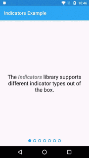

 Indicators
===================================
[![Build][1]][2]
[![Release][3]][4]

*Indicators* is a micro framework for creating `ViewPager` indicators. Instead
of limited indicator implementations, it provides the means to create new
indicator types without a big effort.

This library works well together with the [Android Data Binding Library] and [Binding Supplies].

Usage
-----

All views of *Indicators* are fully supported in any layout.

    <berlin.volders.indicators.PageIndicators
        android:layout_width="wrap_content"
        android:layout_height="wrap_content"
        app:viewPager="@{viewPager}">

        <berlin.volders.indicators.PageIndicatorView
            android:layout_width="wrap_content"
            android:layout_height="wrap_content"
            app:indicator="@drawable/indicator"
            app:indicatorSpacing="6dp" />
    </berlin.volders.indicators.PageIndicators>

### *\<PageIndicators /\>*

`PageIndicators` is the parent layout to bind to any `ViewPager`. It integrates
well with the [Android Data Binding Library] and provides everything needed to
create indicators easily.

##### Bindings
 * `app:page`
 – Get and set the current page
 * `app:indicatorsObserver`
 – Register any `PageIndicators.Observer` implementation
 * `app:pageObserver`
 – Register any `PageIndicators.PageObserver`
 * `app:pageCountObserver`
 – Register any `PageIndicators.PageObserver`
 * `app:pageStateObserver`
 – Register any `PageIndicators.PageStateObserver`
 * `app:pageScrollObserver`
 – Register any `PageIndicators.PageScrollObserver`

### *\<PageIndicatorView /\>*

`PageIndicatorView` is an implementation of *Indicators* to display a simple
`Drawable` with a *selected* state to indicate the current page.

##### Attributes
 * `android:fillViewport`
 – Whether or not to stretch all indicators
 * `app:indicator`
 – The indicator drawable
 * `app:indicatorSpacing`
 – The spacing between the indicators
 * `app:indicatorWidth`
 – The width of the indicator
 * `app:indicatorHeight`
 – The height of the indicator

##### Bindings
 * `app:pageIndicators`
 – Observe changes to the indicators

### *\<PageNumberView /\>*

`PageNumberView` is a simple `TextView` extension to display the current page
and the page count.

##### Attributes
 * `app:indicatorTemplate` – The spacing between the indicators
 – The template to format the page number and count with
 * `app:indicatorFormatLocalized`
 – Whether or not to use the default locale for formatting

##### Bindings
 * `app:pageIndicators`
 – Observe changes to the indicators

Installation
------------

Add [JitPack][4] to your repositories and *Indicators* to your dependencies

    dependencies {
        compile "berlin.volders:indicators:$indicatorsVersion"
    }

License
-------

    Copyright (C) 2016 volders GmbH with <3 in Berlin

    Licensed under the Apache License, Version 2.0 (the "License");
    you may not use this file except in compliance with the License.
    You may obtain a copy of the License at

        http://www.apache.org/licenses/LICENSE-2.0

    Unless required by applicable law or agreed to in writing, software
    distributed under the License is distributed on an "AS IS" BASIS,
    WITHOUT WARRANTIES OR CONDITIONS OF ANY KIND, either express or implied.
    See the License for the specific language governing permissions and
    limitations under the License.

  [Android Data Binding Library]: https://developer.android.com/topic/libraries/data-binding/index.html
  [Binding Supplies]: https://github.com/volders/Supplies/tree/master/binding
  [1]: https://travis-ci.org/volders/Indicators.svg?branch=master
  [2]: https://travis-ci.org/volders/Indicators
  [3]: https://jitpack.io/v/berlin.volders/indicators.svg
  [4]: https://jitpack.io/#berlin.volders/indicators
